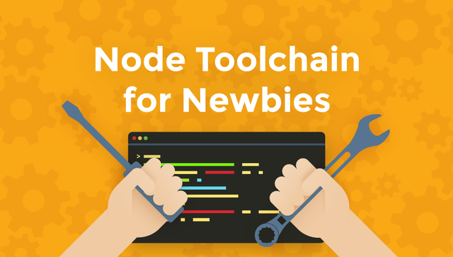
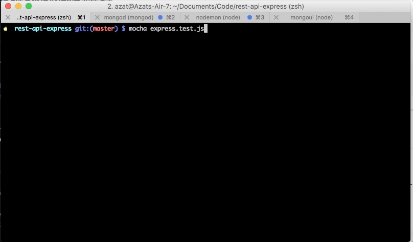
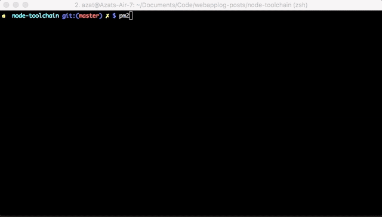

footer: © NodeProgram.com, Node.University and Azat Mardan 2017
theme: Simple, 1
build-lists: true

[.slidenumbers: false] 
[.hide-footer]

---

# Node Toolchain for Newbies
## The Best Node Apps and Libraries to Increase Productivity

Azat Mardan @azat_co

---

## "What tools would you recommend for Node development?" 

* IDEs/code editors
* Libraries
* GUI tools
* CLI tools

---

# IDEs/code editors

---

# Atom

* [Atom](https://www.npmjs.com/package/atom-package-manager): created and maintained by GitHub; uses Electron, HTML, JS and CSS under the hood which makes it very easy to customize or add functionality; allows to have Git and terminal support via packages. Price: free.

---

# VS Code

* [VS Code](https://code.visualstudio.com): a newer addition; uses similar to Atom web-based tech; was created from Azure's Monaco editor; comes with debugging, smart autocomplete based on types, Git and terminal support. Price: free.

---

# WebStorm

[WebStorm](https://www.jetbrains.com/webstorm): more of an IDE than an editor, developed by JetBrains and based on IntelliJ platform; has [code assistance](https://www.jetbrains.com/webstorm/features/coding-assistance.html), debugging, testing, Git. Price: starts at $59/yr for individuals.

---

There are more options like Brackets, Sublime Text 3 and of course IDEs like Eclipse, Aptana Studio, NetBeans, Komodo IDE, and cloud-based like Cloud 9, Codenvy.

---

# What to pick? 

VS Code

---

---

## The most popular and useful libraries and project dependencies

The libraries are listed with the npm names, so you can execute `npm i {name}` substituting `{name}` with the name of the package/module:

---

# webpack

[webpack](https://webpack.github.io/docs/node.js-api.html): Builds static assets like browser JavaScript, CSS and even images. It allows to use node modules in the browser.

---

# babel

[babel](https://babeljs.io): Allows to code in the latest versions of JavaScript/ECMAScript without having to worry about your runtime by converting the new code to the code compatible with older versions of ECMAScript

---

# axios

[axios](https://www.npmjs.com/package/axios): Makes HTTP requests

---

# express

[express](https://expressjs.com): the most popular Node web framework

---

# mongoose

[mongoose](http://mongoosejs.com): MongoDB object-document mapper library

---

# sequelize

[sequelize](https://www.npmjs.com/package/sequelize): PostgreSQL object-relational mapper library

---

# socket.io

[socketio.io](https://socket.io): Real-time library with support of Web Sockets and others.

---

# cheerio

[cheerio](https://cheerio.js.org): jQuery syntax for working with HTML-like data on the server

---

# node-oauth

[node-oauth](https://www.npmjs.com/package/node-oauth): Low-level but very mature and tested library to roll out any OAuth integration

---

# passport

[passport](http://passportjs.org/): OAuth library to quickly integrate with major services

---

# yargs

[yargs](http://yargs.js.org)

---

# shelljs

[shelljs](http://documentup.com/shelljs/shelljs)

---

# mocha

[mocha](https://mochajs.org): Testing framework

---

# async

[async](https://www.npmjs.com/package/async): Controls flow by running function concurrently, sequentially or any way you want

---

# concurrently

[concurrently](https://www.npmjs.com/package/concurrently): Allows to execute CLI tools (local) as multiple processes all at the same time, e.g., webpack and node-static.

---

---

Note: Some of the libraries/tools listed above like webpack or mocha, can be installed globally instead of locally in your project folder. However, installing them globally is an old practice and currently is an anti-pattern because local installation allows developers to use multiple versions of the tool with different projects in addition to have these tools specified in package.json.

---

Of course there are a lot of different options in each category. For example, [request](https://www.npmjs.com/package/request) and [superagent](https://www.npmjs.com/package/superagent) are also extremely popular HTTP agent libraries. However, I don't want to give too many options and confuse you with the differences, I listed only one tool (typically the one I use the most currently).

---

## CLI tools (global)

---

Unlike the previous section, these tools are okay to install globally since most likely their version won't affect or break your project.

---

# node-dev

[node-dev](https://www.npmjs.com/package/nodedev): Monitor and restart your Node app automatically on any file change within the current folder

---

# node-static

[node-static](https://www.npmjs.com/package/node-static): Serve files over HTTP web server

---

# node-inspector

[node-inspector](https://www.npmjs.com/package/node-inspector): Debug Node code in a familiar interface of DevTools (now part of Node starting with v7)

---

# docker

[docker](https://www.docker.com/): Build and run Docker containers to isolate app environment, speed up deployment and eliminate conflicts between dev and prod (or any other) environments

---

# curl

curl: Make HTTP(S) requests to test your web apps (default for POSIX but can [get for Windows too](https://curl.haxx.se/download.html))

---

# nvm

[nvm](https://github.com/creationix/nvm/blob/master/README.markdown): Change Node versions without having to install and re-install them each time

---

# wintersmith

[wintersmith](http://wintersmith.io/): Build static website using Node templates and Markdown

---

# pm2

[pm2](http://pm2.keymetrics.io/): Process manager to vertically scale Node processes and ensure fail-tolerance and 0-time reload

---

---

# GUI tools

---

A good share of Node developers prefer GUI (graphical user interface) tools at least for some of the tasks because these tools require less typing and have features which makes them more productive and the development easier and simpler.

---

# Postman

[Postman](https://www.getpostman.com): HTTP client with ability to save requests and history, change formats (JSON, form, etc.) and do other things

---

# MongoUI

[MongoUI](https://github.com/azat-co/mongoui): Modify and inspect your MongoDB data in a web interface. You can host this web app on your server to enable the database management.

---

# Chrome

[Chrome](https://www.google.com/chrome/browser/desktop): DevTools is a great way to inspect your requests, network, traffic, CPU profiles and other developer related data which is very useful for debugging

---

iTerm, itermocil and zsh: A better alternative to a native macOS Terminal app which together with itermocil and zsh increases productivity greatly

---

# SourceTree

[SourceTree](https://www.sourcetreeapp.com): Visual git trees and histories

---

---

# THE END

Next courses to take:

* Node Foundation
* Express Foundation
* React Foundation